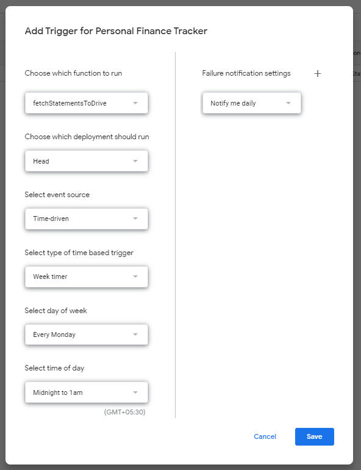

# Backup Gmail Attachments on Google Drive

## Description

I thought of this project to backup my bank, credit card, CAS and NPS monthly statements. This code is specific for these statements but can be modified and used to save other PDF attachements as well.

## Getting Started

### Dependencies

-   Gmail Account with labels setup for emails
-   An appscript file in Google Drive

### Installing

-   Open Appscript file in the google drive and add the code.

### Executing program

-   Click on the run button in apps script to execute the script.
-   Alternatively you can setup a trigger to run on a weekly or montly basis to execute the script automatically by creating a trigger shown below
    

```
code blocks for commands
```

## Authors

Contributors names and contact info

-   Bhavansh Gupta

## Version History

-   0.1
    -   Initial Release

## License

This project is licensed under the MIT License - see the LICENSE.md file for details
